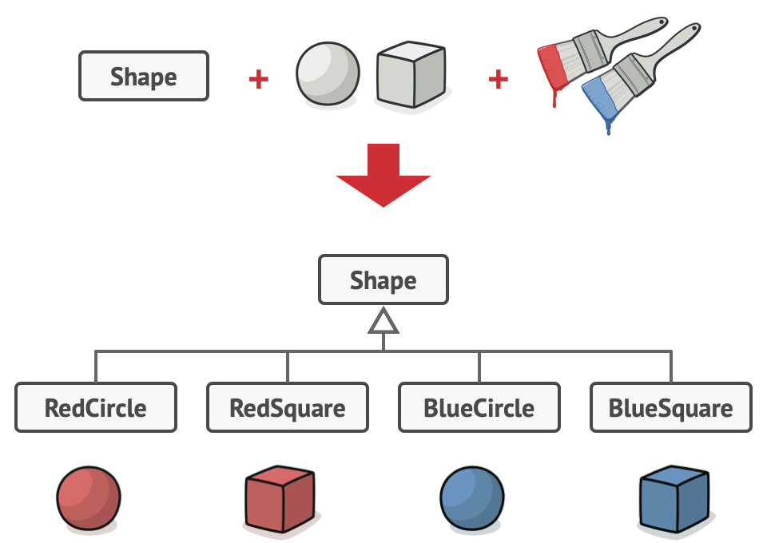

# Module 8 — Bridge Pattern

---

## 1) Definition & Intent

[Bridge design pattern Link](https://refactoring.guru/design-patterns/bridge)

**Bridge** decouples an abstraction from its implementation so the two can vary independently.
It lets you change **both* the abstraction (what the client sees) and the implementation (how it’s done) without coupling them.

**Intent:** separate *what* something does from *how* it does it.

>Bridge is a structural design pattern that lets you split a large class or a set of closely related classes into two separate hierarchies—abstraction and implementation—which can be developed independently of each other.

---

## Problem

>Say you have a geometric **Shape** class with a pair of subclasses: **Circle** and **Square**. You want to extend this class hierarchy to incorporate colors, so you plan to create Red and Blue shape subclasses. However, since you already have two subclasses, you’ll need to create four class combinations such as BlueCircle and RedSquare.



> Adding new shape types and colors to the hierarchy will grow it exponentially. For example, to add a triangle shape you’d need to introduce two subclasses, one for each color. And after that, adding a new color would require creating three subclasses, one for each shape type. The further we go, the worse it becomes.

---

## Solution

This problem occurs because we’re trying to extend the shape classes in two independent dimensions: by form and by color. That’s a very common issue with class inheritance.

> The Bridge pattern attempts to solve this problem by switching from inheritance to the object composition. What this means is that you extract one of the dimensions into a separate class hierarchy, so that the original classes will reference an object of the new hierarchy, instead of having all of its abstractState and behaviors within one class.


> Following this approach, we can extract the color-related code into its own class with two subclasses: Red and Blue. The Shape class then gets a reference field pointing to one of the color objects. Now the shape can delegate any color-related work to the linked color object. That reference will act as a bridge between the Shape and Color classes. From now on, adding new colors won’t require changing the shape hierarchy, and vice versa.


---


## 2) When to use (problem it solves)

* You have **orthogonal dimensions of variability**. e.g. multiple UI controls (abstractions) × multiple rendering engines/platforms (implementations).
* Without Bridge you'd get a combinatorial explosion of classes (one class per combination).
* You want to extend either side independently (new abstraction or new implementation) without touching existing code.

---

## 3) Quick contrast with similar patterns

* **Adapter**: makes incompatible interfaces work together (wraps).
* **Bridge**: intentionally separates abstraction & implementation from the start (composition).
* **Strategy**: interchangeable algorithms for a single behavior. Bridge is structural for abstraction/implementation split; Strategy focuses on runtime algorithm selection.

---

## 4) BAD design (no bridge — combinatorial explosion)

Imagine shapes (Circle, Square) and renderers (VectorRenderer, RasterRenderer).

Without Bridge, you might have classes:

* `VectorCircle`, `RasterCircle`, `VectorSquare`, `RasterSquare` — that’s 2 × 2 = 4 classes.
  Add one more shape and one more renderer → multiplies.

---

## 5) ✅ GOOD design (Bridge applied)

### Core idea

* `Shape` (abstraction) holds a reference to `Renderer` (implementation).
* `Renderer` is an interface with different concrete renderers.
* New shapes or new renderers can be added independently.

### Example (Java)

```java
// Implementation hierarchy (the "bridge" side)
public interface Renderer {
    void renderCircle(float radius);
    void renderSquare(float side);
}

public class VectorRenderer implements Renderer {
    @Override public void renderCircle(float radius) {
        System.out.println("Vector render circle with radius " + radius);
    }
    @Override public void renderSquare(float side) {
        System.out.println("Vector render square with side " + side);
    }
}

public class RasterRenderer implements Renderer {
    @Override public void renderCircle(float radius) {
        System.out.println("Raster render circle pixels for radius " + radius);
    }
    @Override public void renderSquare(float side) {
        System.out.println("Raster render square pixels for side " + side);
    }
}

// Abstraction hierarchy
public abstract class Shape {
    protected final Renderer renderer; // bridge to implementation

    protected Shape(Renderer renderer) {
        this.renderer = renderer;
    }

    public abstract void draw(); // high-Level operation
    public abstract void resize(float factor);
}

public class Circle extends Shape {
    private float radius;

    public Circle(Renderer renderer, float radius) {
        super(renderer);
        this.radius = radius;
    }

    @Override public void draw() {
        renderer.renderCircle(radius);
    }

    @Override public void resize(float factor) {
        radius *= factor;
    }
}

public class Square extends Shape {
    private float side;
    public Square(Renderer renderer, float side) {
        super(renderer);
        this.side = side;
    }
    @Override public void draw() {
        renderer.renderSquare(side);
    }
    @Override public void resize(float factor) {
        side *= factor;
    }
}

// Client demo
public class BridgeDemo {
    public static void main(String[] args) {
        Renderer vector = new VectorRenderer();
        Renderer raster = new RasterRenderer();

        Shape circleVector = new Circle(vector, 5);
        Shape circleRaster = new Circle(raster, 5);

        circleVector.draw(); // Vector version
        circleRaster.draw(); // Raster version

        // Add a new renderer later without changing Circle class
    }
}
```

**Why this works:** adding `Triangle` or `OpenGLRenderer` requires only one new class (shape or renderer), not a combinatorial set.

---

## 6) Real-world analogy

Imagine TV sets (abstractions) and regional power plugs / sockets (implementations).

* TV model A, model B (abstractions)
* US plug, EU plug (implementations)
  A TV takes a plug adapter interface; you can pair any TV with any plug implementation without rewriting TVs for each region.

---

## 7) When NOT to use / pitfalls

* Over-architecting small problems — if you only ever have 1 abstraction and 1 implementation, Bridge adds unnecessary indirection.
* Confusing Bridge with Adapter/Strategy — they solve different problems.
* If you expose too many methods on the `Renderer` interface, you may couple implementations to all abstractions; prefer minimal, focused implementation interface.

---

## 8) Testability & benefits

* Test `Renderer` implementations independently (unit tests) and test `Shape` logic by injecting test doubles (mocks/stubs) for `Renderer`.
* Bridge promotes **single responsibility** and **open/closed**: add new shapes/renderers without changing existing code.

---

## 9) Exercises (try them)

1. Implement `Triangle` shape and `SvgRenderer` that prints SVG-like output. Show you can pair any shape with any renderer.
2. Convert your `ReportGenerator` example: `Report` is abstraction, `Exporter` is implementation (CSV/Excel/PDF). Rework into Bridge so you can add formats and report types independently.
3. Unit-test `Circle` with a mock `Renderer` verifying `renderCircle` is called with correct radius after `resize()`.

---

## 10) Interview questions (Bridge)

1. What is the Bridge pattern and when would you use it?
2. How does Bridge help avoid class explosion? Give a small example.
3. How is Bridge different from Adapter and Strategy?
4. Can you show how to add a new renderer and a new shape without modifying existing classes?
5. Why prefer composition over inheritance in Bridge?


## 11) Pros and Cons

1. Pros:

- You can create platform-independent classes and apps.
- The client code works with high-level abstractions. It isn’t exposed to the platform details. 
- Open/Closed Principle. You can introduce new abstractions and implementations independently from each other.
- Single Responsibility Principle. You can focus on high-level logic in the abstraction and on platform details in the implementation.

2. Cons:

- You might make the code more complicated by applying the pattern to a highly cohesive class.

