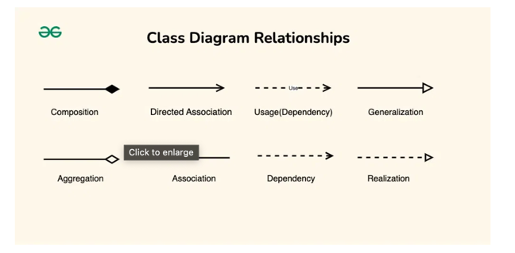

# UML

[Reference link](https://www.geeksforgeeks.org/system-design/unified-modeling-language-uml-class-diagrams/)




```java
class OrderService {
    public void processOrder(Order order, EmailService emailService) {
        // Uses EmailService temporarily
        emailService.sendConfirmation(order);
    }
}
```

**When to use:**
- Method parameters
- Local variables
- Static method calls
- Return types

---

## **Visual Summary of All Relationships:**
```
1. ASSOCIATION (Basic relationship)
   [ClassA] ────── [ClassB]
   [ClassA] ────> [ClassB]  (unidirectional)

2. AGGREGATION (Weak "has-a", shared ownership)
   [Whole] ◇────── [Part]
   Example: [Playlist] ◇────── [Song]

3. COMPOSITION (Strong "has-a", exclusive ownership)
   [Whole] ◆────── [Part]
   Example: [House] ◆────── [Room]

4. INHERITANCE (is-a)
            [Parent]
               △
               │
            [Child]

5. REALIZATION (implements)
        <<interface>>
         [Interface]
             △
             ┆
          [Class]

6. DEPENDENCY (uses temporarily)
   [ClassA] ╌╌╌╌> [ClassB]
```

---

## **Multiplicity Notations:**

Shows how many instances are involved in the relationship.
```
[Teacher] 1 ────── 0..* [Student]
```

**Common multiplicities:**
- `1` - Exactly one
- `0..1` - Zero or one (optional)
- `*` or `0..*` - Zero or more
- `1..*` - One or more
- `m..n` - Between m and n
- `5` - Exactly 5

**Examples:**
```
[Person] 1 ────── 1 [Passport]
// One person has exactly one passport

[Author] 1 ────── 1..* [Book]
// One author writes one or more books

[Student] * ────── * [Course]
// Many students enroll in many courses

[Car] 1 ◆────── 4 [Wheel]
// One car has exactly 4 wheels
```

---

## **Complete Example with All Relationships:**
```
                <<interface>>
                  [Drawable]
                      △
                      ┆ (realization)
                      ┆
        ┌─────────────┴─────────────┐
        │                           │
    [Shape]                     [Component]
       △                             │
       │ (inheritance)               │
       │                             │
   ┌───┴───┐                        │
   │       │                        │
[Circle] [Square]                   │
                                    │
                                    │
[Canvas] ◇────── [Shape]            │
  │  │  (aggregation)               │
  │  │                              │
  │  └──────────────────────────────┘
  │         (dependency)
  │
  ◆ (composition)
  │
[Layer]

Additional:
[DrawingTool] ╌╌╌> [Canvas] (uses)
```