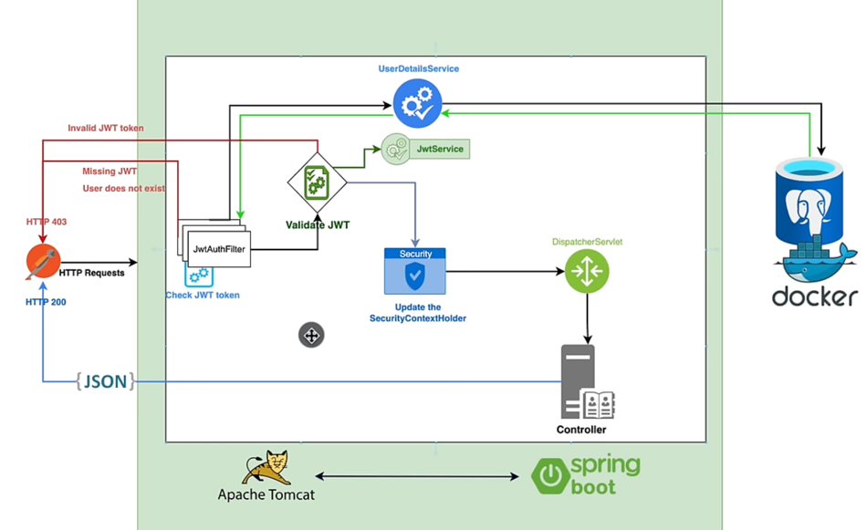

# JWT



Perfect — here’s a **clean 1-page revision note** you can read **before interviews**.
It’s concise, structured, and includes **secret key, signing, auth vs authz, and real-world usage**.

---

# 🔐 JWT + Spring Security — 1-Page Revision Notes

## 1️⃣ What problem JWT solves

JWT enables **stateless authentication**:

* No HTTP session
* No server-side login state
* Each request carries proof of identity

Best for:

* REST APIs
* Microservices
* Scalable systems

---

## 2️⃣ Authentication vs Authorization (VERY IMPORTANT)

### 🔹 Authentication = *Who are you?*

* Login / register
* Username + password verification
* Token generation happens here

### 🔹 Authorization = *What are you allowed to do?*

* Role / permission checks
* Happens on every request

👉 **JWT is NOT authentication by itself**
JWT is a **token format used after authentication**.

**Correct statement for interviews:**

> JWT is commonly used to carry authentication information and enable authorization in stateless systems.

---

## 3️⃣ High-level request flow

### 🔹 Login / Register

```
Client → Auth API → Credentials verified → JWT created → Token returned
```

### 🔹 Secured API request

```
Client → Authorization: Bearer <JWT>
       → JWT Filter
       → SecurityContext populated
       → Authorization check
       → Controller
```

---

## 4️⃣ Role of Spring Security in your setup

Spring Security:

* Does NOT create JWT automatically
* Manages:

    * AuthenticationManager
    * Password verification
    * Authorization rules
* Relies ONLY on:

  ```
  SecurityContextHolder.getContext().getAuthentication()
  ```

If Authentication exists → access allowed
If not → 401 / 403

---

## 5️⃣ What your JWT filter does

Your JWT filter:

1. Intercepts every request
2. Extracts JWT from `Authorization` header
3. Validates token
4. Loads user from DB
5. Creates Authentication object
6. Stores it in `SecurityContextHolder`

This is the **bridge** between JWT and Spring Security.

---

## 6️⃣ What is the SECRET KEY and why it matters

### 🔹 Purpose of secret key

The secret key is used to **sign the JWT**, ensuring:

* Token integrity
* Token authenticity
* Token cannot be modified

### 🔹 How signing works (HMAC / HS256)

1. Server creates JWT payload
2. Payload is signed using secret key
3. Signature is attached to token
4. On request:

    * Server recalculates signature
    * If mismatch → token rejected

How JWT Signature Verification Works
1. Generation (Signing): The creator takes the encoded header and payload, signs them with a secret/private key using the algorithm specified in the header (e.g., HS256), and Base64Url-encodes the result to create the signature segment.
2. Transmission: The full token (Header.Payload.Signature) is sent to the receiver.
3. Verification (Tamper Detection):
    * The receiver takes the received Header and Payload from the token.
    * It recalculates the signature using the same key and algorithm.
    * It compares the newly calculated signature with the signature appended to the token.
4. Result: If they match, the token is untampered. If they do not match, the token has been altered, and it is rejected. 


### 🔹 Key takeaway

> Anyone can read a JWT, but only the server can **verify** it.

---

## 7️⃣ Signed vs Encrypted (common confusion)

| Concept      | JWT               |
| ------------ | ----------------- |
| Signed       | ✅ Yes             |
| Encrypted    | ❌ No (by default) |
| Tamper-proof | ✅                 |
| Readable     | ✅ (Base64)        |

JWT proves **integrity**, not secrecy.

---

## 8️⃣ Why BCrypt is used for passwords

* One-way hashing
* Includes salt
* Resistant to brute force
* Passwords are **never decoded**

Passwords ≠ JWT
Passwords → hashed & stored
JWT → generated & sent to client

---

## 9️⃣ Statelessness (core design principle)

Your app is **fully stateless**:

* No session
* No server memory
* Each request self-contained

Benefits:

* Horizontal scalability
* Easy load balancing
* Microservice-friendly

---

## 🔟 Where companies store JWT (REAL WORLD)

### ✅ Common & Recommended

#### 🔹 HttpOnly Cookie (MOST SECURE)

* Not accessible by JS
* Safe from XSS
* Used by banks, fintechs

#### 🔹 In-memory (SPA apps)

* Stored in JS memory
* Lost on refresh
* Safer than localStorage

---

### ❌ Avoid (unless you know risks)

#### 🔸 localStorage / sessionStorage

* Vulnerable to XSS
* Still widely used, but risky

---

## 1️⃣1️⃣ Do companies really do this?

### ✅ YES — exactly this pattern

Used by:

* Netflix
* Amazon
* Uber
* Most Spring Boot microservices

With variations:

* Access token + Refresh token
* Short-lived JWTs
* API Gateway validation
* OAuth2 on top

Your implementation is a **real industry baseline**.

---

## 1️⃣2️⃣ Common interview questions (quick answers)

**Q: Is JWT authentication or authorization?**

> JWT is a token format used after authentication to support authorization.

**Q: Why not sessions?**

> Sessions don’t scale well in distributed systems.

**Q: Can JWT be hacked?**

> Only if secret key is compromised or token is stored insecurely.

**Q: Can JWT be revoked?**

> Not easily; requires expiry or token blacklist.

---

## 1️⃣3️⃣ One-liner interview summary (VERY STRONG)

> I implemented stateless authentication using JWT with Spring Security, where tokens are signed using a secret key, validated on every request by a custom filter, and authorization is handled through Spring’s SecurityContext.

---

## ✅ Final Verdict

* ✔️ Your implementation is correct
* ✔️ Matches real-world systems
* ✔️ Interview-ready
* ✔️ Scalable & secure

---

If you want next:

* Add **refresh token flow**
* Compare **JWT vs OAuth2**
* Draw **sequence diagram**
* Prepare **advanced interview Q&A**

Just say 👍

